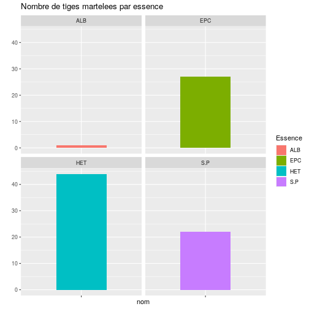

**Participant : Jean**

---

---
<table class="table table-striped" style="">
 <thead>
  <tr>
   <th style="text-align:left;">   </th>
   <th style="text-align:right;"> PB </th>
   <th style="text-align:right;"> BM </th>
   <th style="text-align:right;"> GB </th>
   <th style="text-align:right;"> TGB </th>
  </tr>
 </thead>
<tbody>
  <tr>
   <td style="text-align:left;"> ALB </td>
   <td style="text-align:right;"> 0 </td>
   <td style="text-align:right;"> 0 </td>
   <td style="text-align:right;"> 0 </td>
   <td style="text-align:right;"> 0 </td>
  </tr>
  <tr>
   <td style="text-align:left;"> EPC </td>
   <td style="text-align:right;"> 0 </td>
   <td style="text-align:right;"> 1 </td>
   <td style="text-align:right;"> 1 </td>
   <td style="text-align:right;"> 0 </td>
  </tr>
  <tr>
   <td style="text-align:left;"> FRE </td>
   <td style="text-align:right;"> 0 </td>
   <td style="text-align:right;"> 0 </td>
   <td style="text-align:right;"> 0 </td>
   <td style="text-align:right;"> 0 </td>
  </tr>
  <tr>
   <td style="text-align:left;"> HET </td>
   <td style="text-align:right;"> 4 </td>
   <td style="text-align:right;"> 4 </td>
   <td style="text-align:right;"> 0 </td>
   <td style="text-align:right;"> 0 </td>
  </tr>
  <tr>
   <td style="text-align:left;"> S.P </td>
   <td style="text-align:right;"> 3 </td>
   <td style="text-align:right;"> 4 </td>
   <td style="text-align:right;"> 3 </td>
   <td style="text-align:right;"> 1 </td>
  </tr>
  <tr>
   <td style="text-align:left;"> SOR </td>
   <td style="text-align:right;"> 1 </td>
   <td style="text-align:right;"> 0 </td>
   <td style="text-align:right;"> 0 </td>
   <td style="text-align:right;"> 0 </td>
  </tr>
</tbody>
</table>

Tiges martelées

---

__Coefficient K : 1.0130039__

K = ve/va où ve est le volume de l'arbre moyen enlevé à l'éclaircie et va est le volume de l'arbre moyen avant éclaircie.

Si K < 0,7 l'éclaircie est qualifiée de « par le bas »  
si K > 1, de « par le haut », et  
si 0,7 < K < 1, de « mixte »

---

__Nombre de tiges martelées : 39__

---

Graphique de la répartition des tiges martelées

Le martelage est-il en ilôts ? (trouée de lumière) en périphérie ? diffus ?
On pourra s’interroger sur les questions d’équilibre sylvo-cygenetique et s’il faut-il travailler au profit de la régénération ? Sans protection et selon l’équilibre forêt-gibier la régénération est-elle viable ?

---

---

Graphique du nombre de tiges martelées par raison de martelage et par essence.

On pourra aborder ici la question du choix de l’essence ou des essences objectifs de la parcelle. On pourra discuter de l’avenir de telle ou telle essence dans la parcelle, de son rôle, est-elle éducatrice, compétitrice, productrice et est-elle adaptée au climat actuel et le sera-t-elle face au réchauffement climatique. On amènera les participants à s’interroger sur les potentialité actuelles et futures de la station forestière.

---

Graphique du prélèvement en surface terrière par essence

Le trait orange indique l'accroissement en m².ha annuel  
Le trait rouge indique l'accroissement en m².ha sur 5 ans

Une essence est-elle plus souvent martelée qu'une autre ? à relativiser selon la proportion de l'espèce dans le peuplement

---

Graphique de la Proportion d'arbres prélevés par catégorie de diamètre

On pourra amener les participants à réfléchir au type de martelage effectué. Les arbres récoltés sont-ils majoritairement des PB et BM, on parle alors de martelage par le bas : on prélève en priorité dans les jeunes petits bois de manière à favoriser les sujets d’avenir et leur permettre une croissance optimum pour produire du bois de qualité. Ou le martelage a-t-il été effectuépar le « haut » : on prélève en priorité les gros et très gros bois arrivés à leur dimension d’exploitabilité.

---

Ce graphique présente par essence le taux de prélèvement de l’accroissement et du passage à la futaie. Si l’on prélève plus que l’accroissement naturel, on va avoir tendance à diminuer la quantité de bois dans le peuplement, on parle alors de décapitalisation, à l’inverse si l’on prélève moins que l’accroissement on aura tendance à recapitaliser. Concernant le passage à la futaie, si l’on prélève plus de tiges que le peuplement n’en génère on aura tendance à faire vieillir le peuplement.

---

Graphique de la surface terrière selon les classes de diamètres avant et après martelage

---

__Somme des prix des arbres martelés = 1980 €__

---

Graphique des prélèvements de DMH

---

