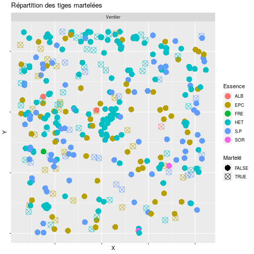
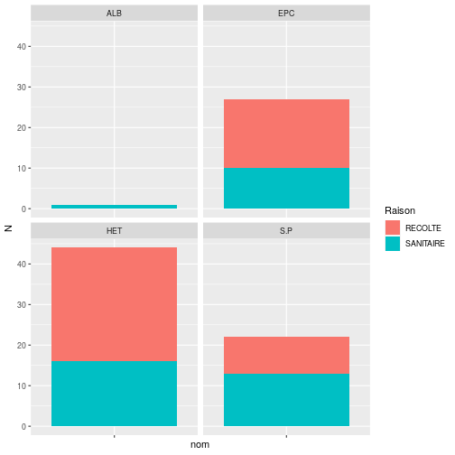
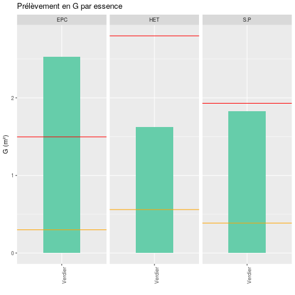
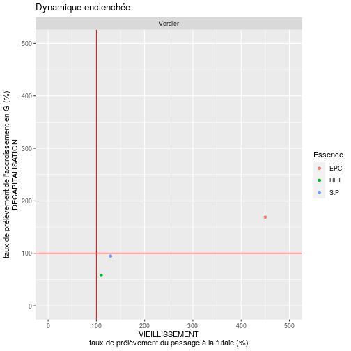
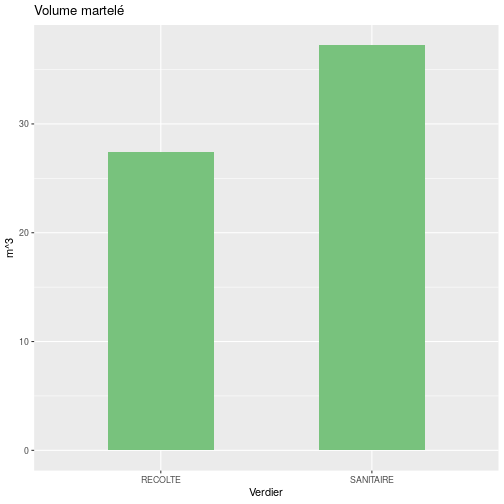

Participant : Pavot

<table class="table table-striped" style="">
 <thead>
  <tr>
   <th style="text-align:left;">   </th>
   <th style="text-align:right;"> PB </th>
   <th style="text-align:right;"> BM </th>
   <th style="text-align:right;"> GB </th>
   <th style="text-align:right;"> TGB </th>
  </tr>
 </thead>
<tbody>
  <tr>
   <td style="text-align:left;"> ALB </td>
   <td style="text-align:right;"> 1 </td>
   <td style="text-align:right;"> 0 </td>
   <td style="text-align:right;"> 0 </td>
   <td style="text-align:right;"> 0 </td>
  </tr>
  <tr>
   <td style="text-align:left;"> EPC </td>
   <td style="text-align:right;"> 1 </td>
   <td style="text-align:right;"> 1 </td>
   <td style="text-align:right;"> 1 </td>
   <td style="text-align:right;"> 0 </td>
  </tr>
  <tr>
   <td style="text-align:left;"> FRE </td>
   <td style="text-align:right;"> 0 </td>
   <td style="text-align:right;"> 0 </td>
   <td style="text-align:right;"> 0 </td>
   <td style="text-align:right;"> 0 </td>
  </tr>
  <tr>
   <td style="text-align:left;"> HET </td>
   <td style="text-align:right;"> 2 </td>
   <td style="text-align:right;"> 1 </td>
   <td style="text-align:right;"> 0 </td>
   <td style="text-align:right;"> 0 </td>
  </tr>
  <tr>
   <td style="text-align:left;"> S.P </td>
   <td style="text-align:right;"> 0 </td>
   <td style="text-align:right;"> 4 </td>
   <td style="text-align:right;"> 0 </td>
   <td style="text-align:right;"> 0 </td>
  </tr>
  <tr>
   <td style="text-align:left;"> SOR </td>
   <td style="text-align:right;"> 0 </td>
   <td style="text-align:right;"> 0 </td>
   <td style="text-align:right;"> 0 </td>
   <td style="text-align:right;"> 0 </td>
  </tr>
</tbody>
</table>

Table des cat\u00e9gories de diamètre martel\u00e9es par essence


---


Graphique du nombre de tiges martel\u00e9es par raison de martelage.

---




Graphique du nombre de tiges martel\u00e9es par raison de martelage et par essence.

On pourra aborder ici la question du choix de l’essence ou des essences objectifs de la parcelle. On pourra discuter de l’avenir de telle ou telle essence dans la parcelle, de son rôle, est-elle \u00e9ducatrice, comp\u00e9titrice, productrice et est-elle adapt\u00e9e au climat actuel et le sera-t-elle face au r\u00e9chauffement climatique. On amènera les participants à s’interroger sur les potentialit\u00e9s actuelles et futures de la station forestière.


---


Graphique de la r\u00e9partition des tiges martel\u00e9es

Le martelage est-il en ilôts ? (trou\u00e9es de lumière) en p\u00e9riph\u00e9rie ? diffus ?
On pourra s’interroger sur les questions d’\u00e9quilibre sylvo-cyg\u00e9n\u00e9tique et s’il faut-il travailler au profit de la r\u00e9g\u00e9n\u00e9ration ? Sans protection et selon l’\u00e9quilibre forêt-gibier la r\u00e9g\u00e9n\u00e9ration est-elle viable ?

---




On pourra amener les participants à r\u00e9fl\u00e9chir au type de martelage effectu\u00e9. Les arbres r\u00e9colt\u00e9s sont-ils majoritairement des PB et BM, on parle alors de martelage par le bas : on pr\u00e9lève en priorit\u00e9 dans les jeunes petits bois de manière à favoriser les sujets d’avenir et leur permettre une croissance optimum pour produire du bois de qualit\u00e9. Ou le martelage a-t-il \u00e9t\u00e9 effectu\u00e9 par le « haut » : on pr\u00e9lève en priorit\u00e9 les gros et très gros bois arriv\u00e9s à leur dimension d’exploitabilit\u00e9.


---


```
Graphique du pr\u00e9lèvement en surface terrière par essence

Le trait orange indique l'accroissement en m².ha annuel
Le trait rouge indique l'accroissement en m².ha sur 10 ans

Une essence est-elle plus souvent martel\u00e9e qu'une autre ? à relativiser selon la proportion de l'espèce dans le peuplement
```
---


```
Graphique de la Proportion d'arbres pr\u00e9lev\u00e9s par cat\u00e9gorie de diamètre
Une essence est-elle plus souvent martel\u00e9e selon son diamètre ?

```
---



Ce graphique pr\u00e9sente par essence et par \u00e9quipe le taux de pr\u00e9lèvement de l’accroissement et du passage à la futaie. Si l’on pr\u00e9lève plus que l’accroissement naturel, on va avoir tendance à diminuer la quantit\u00e9 de bois dans le peuplement, on parle alors de d\u00e9capitalisation, à l’inverse si l’on pr\u00e9lève mois que l’accroissement on aura tendance à recapitaliser. Concernant le passage à la futaie, si l’on pr\u00e9lève plus de tiges que le peuplement n’en g\u00e9nère on aura tendance à faire vieillir le peuplement.


---


Graphique de la surface terrière selon les classes de diamètres avant et après martelage


---

```
## Error in data.frame(..., check.names = FALSE): arguments imply differing number of rows: 4, 0
```



Graphique du volume martel\u00e9 par \u00e9quipe


```r
# lst3 <- na.omit(lst3[!lst3$mart=="NA",])
# recette <- left_join(lst3,tab_prix,c("qualite" = "quali"))
# 
# ggplot(recette,aes(x = nom, y = prix_quali*volu)) + geom_col(fill = '#F4D27A',width = 0.5) + ggtitle("Recette") + labs(y = "€", x = "Equipe")
```
---

```r
lst4 <- na.omit(lst4[!lst4$mart=="NA",])
recette <- left_join(lst4,tab_prix,c("qualite" = "quali"))
recette <- recette[!recette$dia2==0,]
dia_10a <-  recette$dia2 + ((recette$dia2 - recette$dia1)/input$duree*10)
recette <- cbind(recette, dia_10a )

recette_10a <-data.frame(prix = recette$prix_quali*recette$volu, perrotte(dia_10a,input$tarif)*recette$prix_quali, nom = recette$nom) %>% reshape2::melt()

ggplot(recette_10a,aes(x = nom, y = value, fill = variable )) + geom_col(position = "dodge",width = 0.5) + ggtitle("Recettes") + labs(y = "", x = "Equipe") + labs(fill = "Prix (€)") + scale_fill_discrete(labels = c("Prix", "Prix à 10 ans"))
```
```
Graphique des recettes


```


```
Graphique des DMH


```
---


